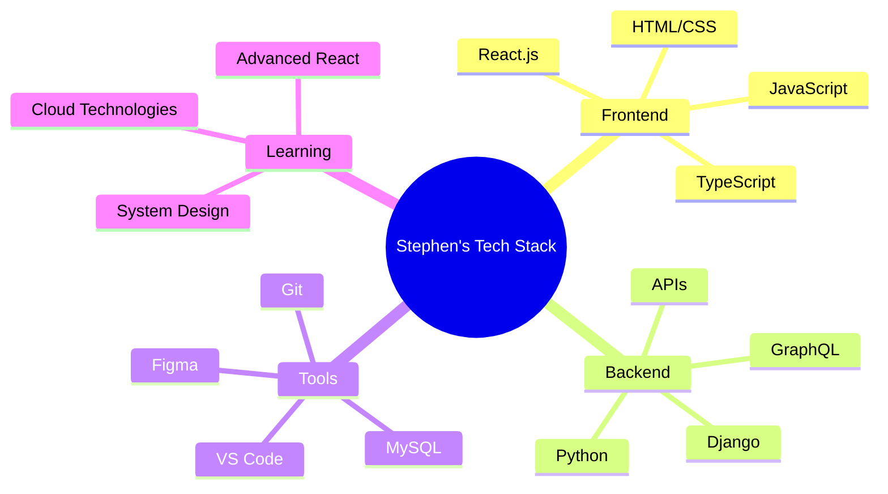

<div align="center">

```ascii
╔══════════════════════════════════════════════════════════════╗
║  ███████╗████████╗███████╗██████╗ ██╗  ██╗███████╗███╗   ██╗ ║
║  ██╔════╝╚══██╔══╝██╔════╝██╔══██╗██║  ██║██╔════╝████╗  ██║ ║
║  ███████╗   ██║   █████╗  ██████╔╝███████║█████╗  ██╔██╗ ██║ ║
║  ╚════██║   ██║   ██╔══╝  ██╔═══╝ ██╔══██║██╔══╝  ██║╚██╗██║ ║
║  ███████║   ██║   ███████╗██║     ██║  ██║███████╗██║ ╚████║ ║
║  ╚══════╝   ╚═╝   ╚══════╝╚═╝     ╚═╝  ╚═╝╚══════╝╚═╝  ╚═══╝ ║
╚══════════════════════════════════════════════════════════════╝
```

</div>

<div align="center">

### 🌍 **Digital Craftsman** • **Code Architect** • **Problem Solver**
*Juja, Kiambu, Kenya* 🇰🇪

[](https://linkedin.com/in/stephen-vincent)
[](https://twitter.com/stephenvin16363)
[](https://www.youtube.com/c/vinnie254.)

</div>

---
<table>
<tr>
<td width="50%">

### 🔥 **Current Trajectory**
```python
class Developer:
    def __init__(self):
        self.name = "Stephen Vincent"
        self.focus = ["React.js", "Django", "TypeScript"]
        self.status = "Building the future, one commit at a time"
        self.coffee_level = "Always Full ☕"
    
    def get_passion(self):
        return "Turning ideas into digital reality"
```

</td>
<td width="50%">

</td>
</tr>
</table>

---

## ⚡ **Tech DNA**

<div align="center">



</div>

---

## 🌊 **Code Ocean** 

<div align="center">

| **🔍 Discovery** | **🚀 Innovation** | **💡 Creation** |
|:---:|:---:|:---:|
|  |  |  |

</div>

---

## 🎨 **Digital Fingerprint**

<details>
<summary><b>🔧 Development Environment</b></summary>

```yaml
OS: 
  - Windows 11 / Linux Ubuntu
  
Editor: 
  - VS Code with custom themes
  - Vim for quick edits
  
Terminal:
  - Windows Terminal / Zsh
  
Workflow:
  - Git Flow
  - Agile Development
  - Test-Driven Development
```

</details>

<details>
<summary><b>🎯 Current Projects</b></summary>

- 🌐 **E-Commerce Platform** - Full-stack Django + React
- 📱 **Mobile-First Web Apps** - Progressive Web Applications  
- 🤖 **API Development** - RESTful services with Django REST Framework
- 🎮 **Interactive Dashboards** - Data visualization with React

</details>

<details>
<summary><b>🌱 Learning Journey</b></summary>

```javascript
const learningPath = {
  current: ["Advanced React Patterns", "Django Best Practices"],
  next: ["GraphQL", "Docker", "AWS"],
  future: ["Machine Learning", "Blockchain", "Mobile Development"],
  philosophy: "Never stop growing 🌱"
};
```

</details>

---

## 🏆 **Achievement Unlocked**

<div align="center">


</div>

---

## 📡 **Activity Radar**

<div align="center">


</div>

---

## 🎵 **Coding Soundtrack**

<div align="center">

```
🎧 Currently vibing to: Lo-fi beats + keyboard clicks
🎶 Debugging playlist: Synthwave + Electronic
🚀 Deploy mode: Upbeat indie rock
```

</div>

---


---

<div align="center">

### 🌟 **"Code is poetry written in logic"** 🌟

**Thanks for stopping by! Let's create something extraordinary together.**


---

<sub>💫 *This README was crafted with passion and a lot of caffeine* ☕</sub>

</div>
